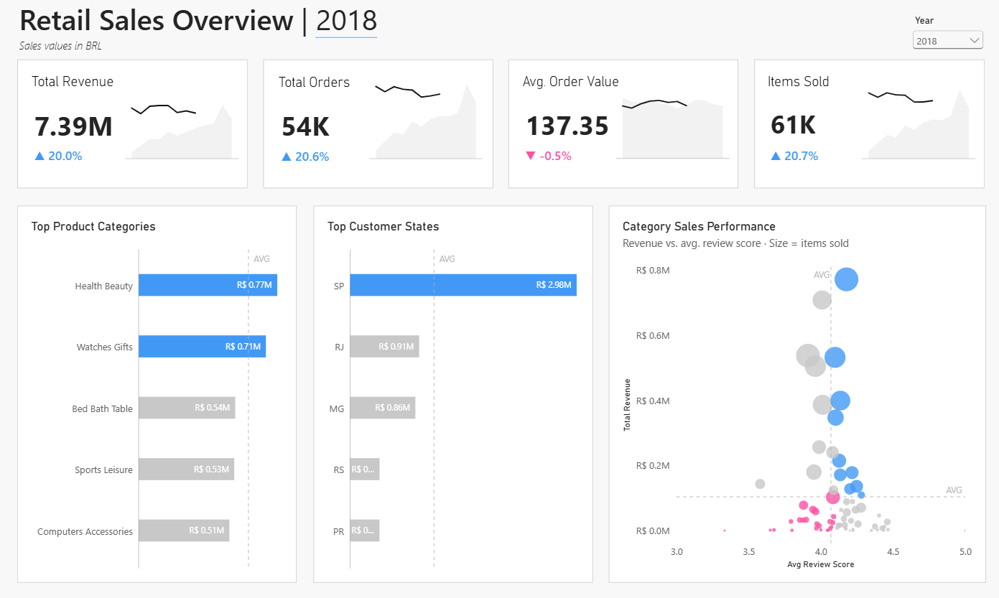
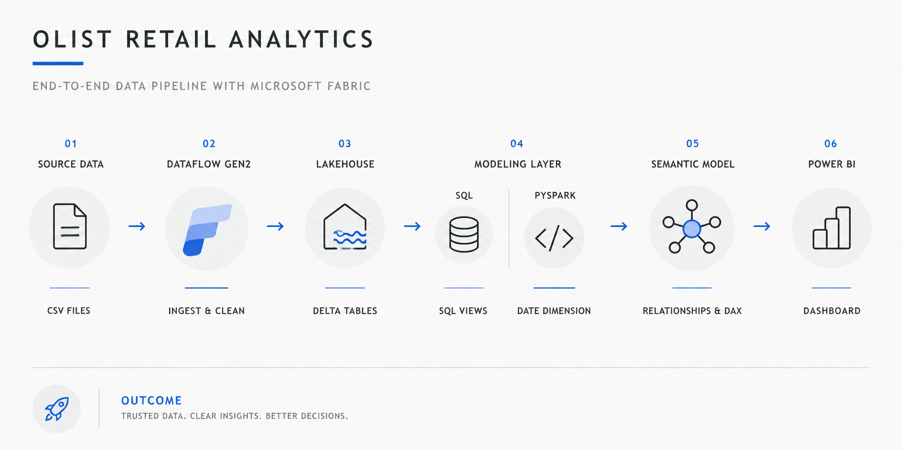
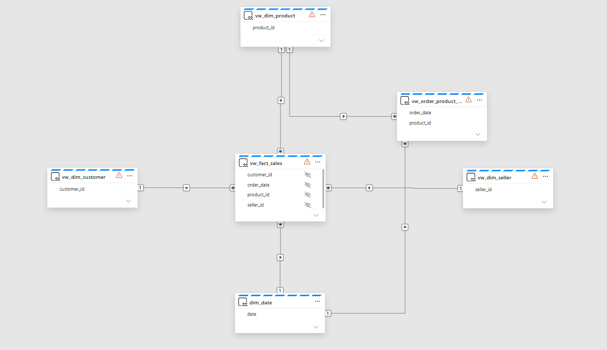

# Retail Analytics with Microsoft Fabric

End-to-end retail analytics project built with **Microsoft Fabric, Dataflow Gen2, Lakehouse, SQL, PySpark, DAX and Power BI**.

The project uses the Brazilian Olist e-commerce dataset to build an analytics workflow from raw data ingestion and transformation through data modeling to an interactive Power BI dashboard.



## Architecture

The solution follows an end-to-end analytics workflow in Microsoft Fabric.



**CSV → Dataflow Gen2 → Lakehouse → SQL & PySpark → Semantic Model → Power BI**

## Data Pipeline

**Dataflow Gen2**  
Raw Olist CSV files are ingested and cleaned before being loaded into the Fabric Lakehouse.

**Lakehouse**  
Cleaned data is stored as Delta tables and provides the source layer for downstream transformations.

**SQL**  
SQL views create the analytical fact and dimension structures used by the semantic model. Separate queries are included for initial data exploration and data quality validation.

**PySpark**  
A reusable date dimension is generated programmatically and persisted as a Delta table for time intelligence.

**Semantic Model**  
The analytical model connects sales with product, customer, seller and date dimensions. DAX measures provide KPIs, year-over-year comparisons and dynamic formatting used in the report.



## Dashboard

The Power BI report provides an overview of retail sales performance, including:

- Total Revenue
- Total Orders
- Average Order Value
- Items Sold
- Year-over-Year performance
- Top Product Categories
- Top Customer States
- Category performance based on revenue, review score and items sold

The category performance view combines commercial performance and customer feedback to identify high-performing and underperforming product categories.

## Repository Structure

```text
fabric-retail-analytics/
│
├── docs/
│   ├── architecture.png
│   ├── dashboard.png
│   └── semantic-model.png
│
├── pyspark/
│   └── create_dim_date.py
│
├── sql/
│   ├── 01_data_exploration.sql
│   ├── 02_data_quality_checks.sql
│   ├── 03_order_reviews_view.sql
│   ├── 04_fact_sales_view.sql
│   ├── 05_dim_product_view.sql
│   ├── 06_dim_customer_view.sql
│   ├── 07_dim_seller_view.sql
│   └── 08_order_product_reviews_view.sql
│
└── README.md
```

## Tech Stack

**Microsoft Fabric** · **Dataflow Gen2** · **Lakehouse** · **SQL** · **PySpark** · **Power BI** · **DAX**

## Dataset

This project uses the public **Brazilian E-Commerce Public Dataset by Olist**, containing information about orders, customers, products, sellers and customer reviews.
